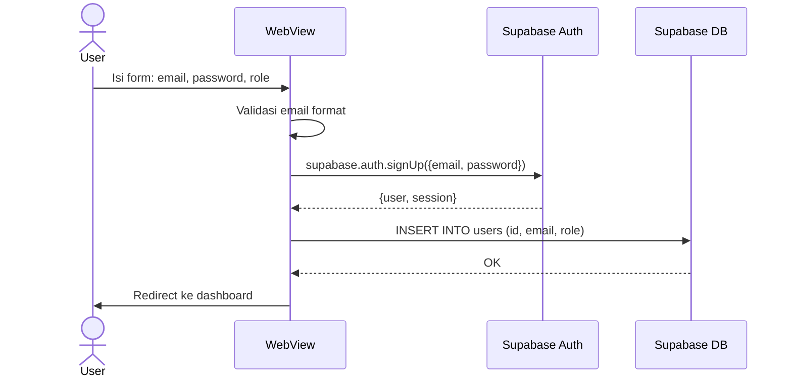
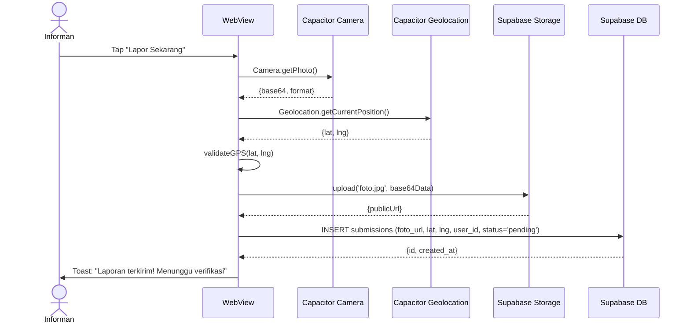
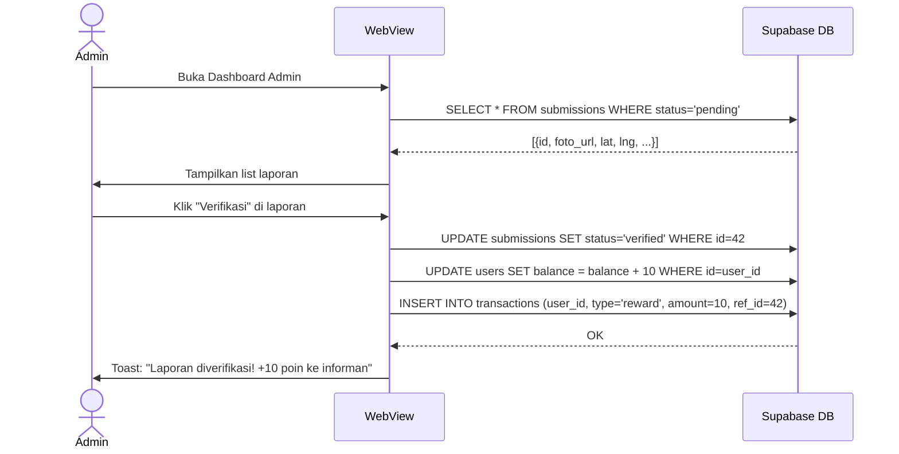
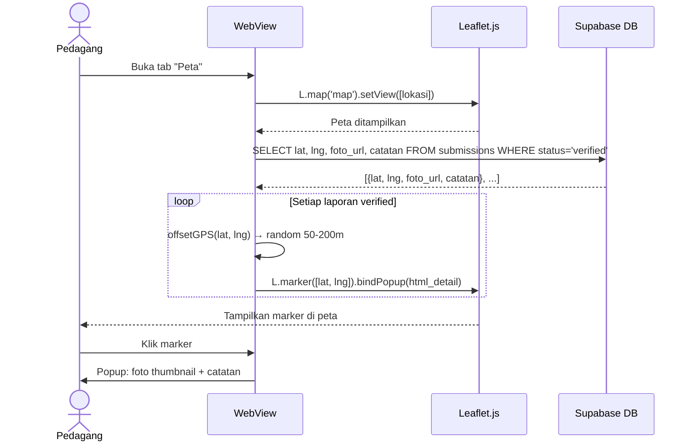
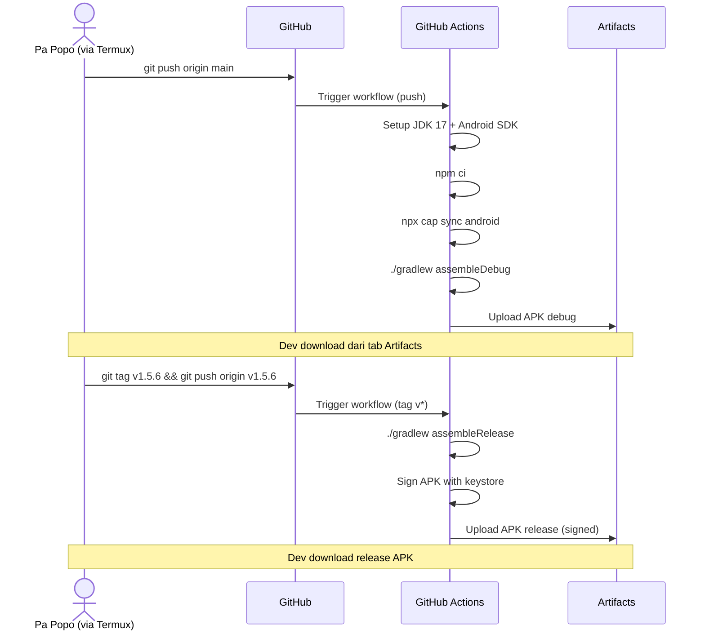
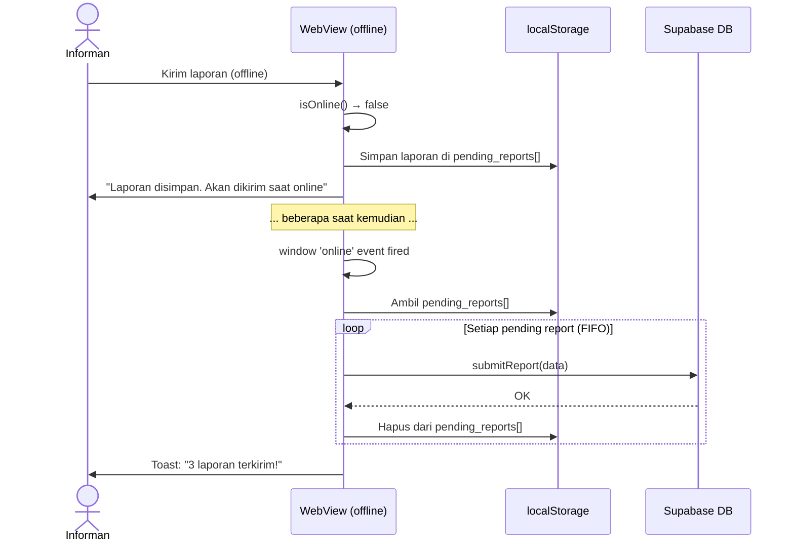

# Sequence Diagrams — Lokasi Sekitar

> **Versi:** 1.0 | **Terakhir diupdate:** 31 Mei 2026
>
> Diagram sekuens untuk interaksi kritis. Format: mermaid (bisa dirender di GitHub).

---

## SD-001: Registrasi User Baru

---

## SD-002: Informan Kirim Laporan

---

## SD-003: Admin Verifikasi Laporan (Approve)

---

## SD-004: Pedagang Lihat Peta + Laporan

---

## SD-005: CI/CD Build & Release APK

---

## SD-006: Offline → Online Sync

---

*Tambahkan sequence diagram baru untuk setiap interaksi kompleks (>3 langkah).*
